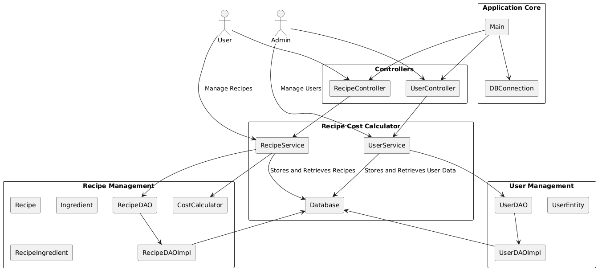
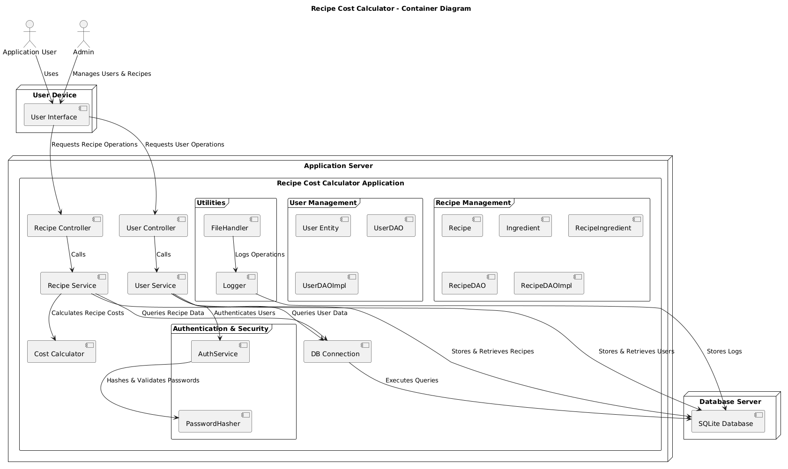
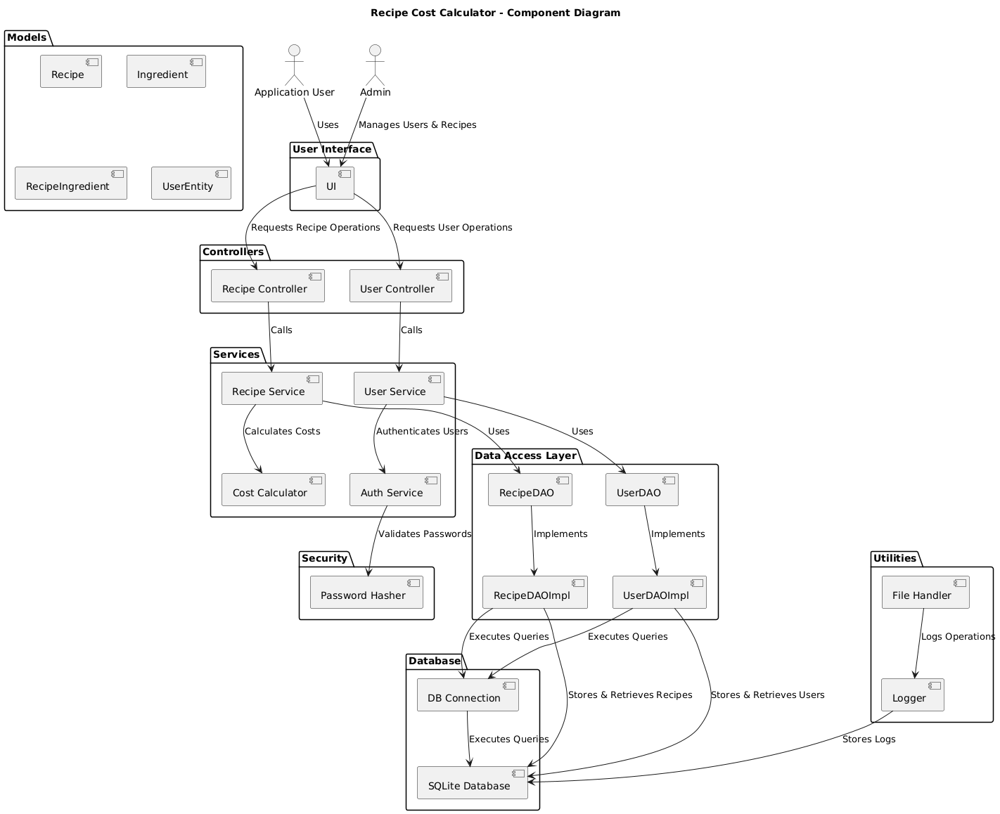
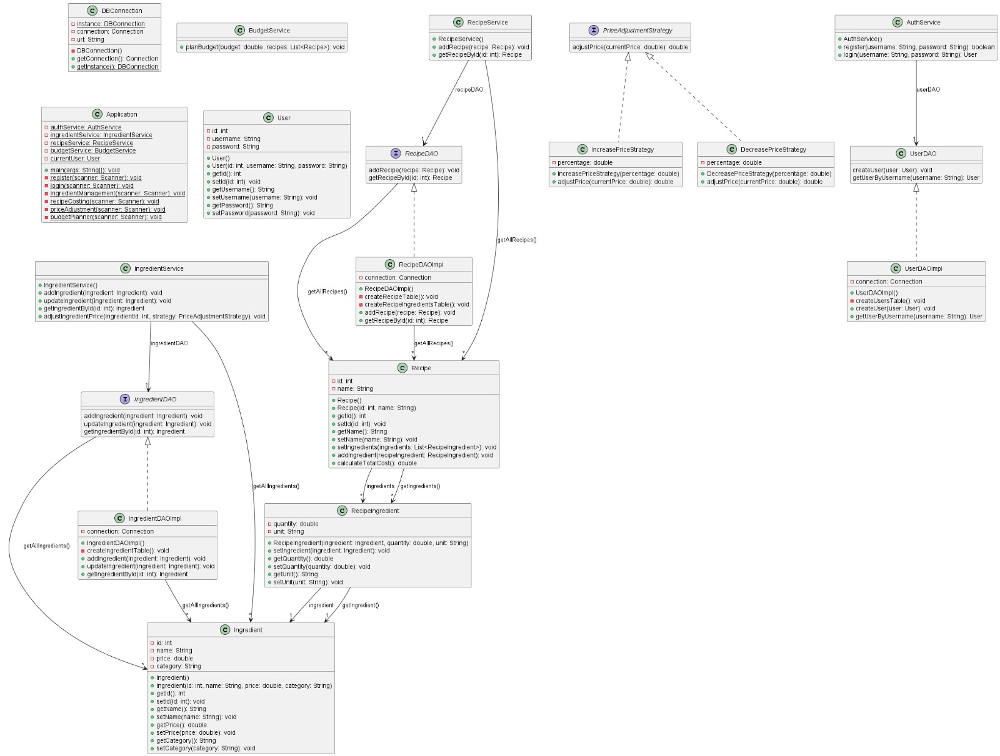
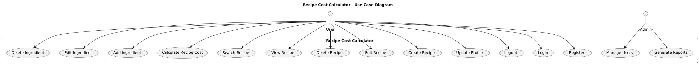
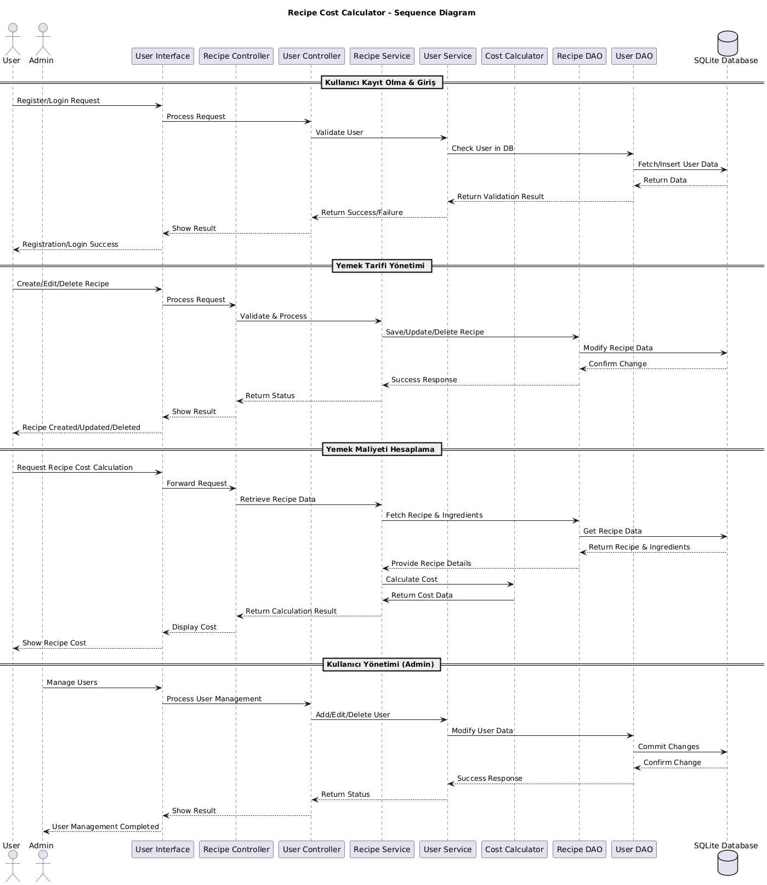

# Recipe Cost Calculator

## Project Description

The Recipe Cost Calculator helps users to calculate the cost of recipes based on the ingredients and quantities used. It allows users to input recipes, calculate their total cost, and retrieve and manage stored recipes.

## Features

- **Recipe management:** Add, edit, delete, and retrieve recipes.
- **Ingredient cost calculation:** Calculate the cost of each recipe based on ingredients.
- **User management:** Authentication and authorization for users to access and manage recipes.

## Releases

- [Latest Release](https://github.com/mustafayanmaz/cen206-hw-mustafa-yanmaz-java)

## Platforms

- 
- 
- 

### Test Coverage Ratios

| Coverage Type |                                                        |
| ------------- | ------------------------------------------------------ |
| Line Based    |         |
| Branch Based  |     |
| Method Based  |     |

### Documentation Coverage Ratios

|                    |                                                     |
| ------------------ | --------------------------------------------------- | 
| **Coverage Ratio** |      |

## Installation

1. Clone this repository using `git clone https://github.com/mustafayanmaz/cen206-hw-mustafa-yanmaz-java`.
2. Open the project in your preferred IDE.
3. Build and run the project.

## Usage

1. Run the program.
2. Follow the interactive menu to add recipes, view all recipes, and calculate recipe costs.

## Contributing

This project is for academic purposes and is closed to contributions.

## License

This project is not permitted for commercial usage.

## Dependencies

- Java 11 or later
- SQLite (for database storage)

## Features

- **Recipe management:** Add, edit, delete, and retrieve recipes.
- **Ingredient management:** Manage ingredients used in recipes.
- **User management:** Authentication and authorization for user access.

## Support

If you encounter any issues or have suggestions for improvements, please open an issue on the [project's GitHub repository](https://github.com/mustafayanmaz/cen206-hw-mustafa-yanmaz-java).

## Acknowledgments

- [SQLite](https://www.sqlite.org/)
- [GitHub](https://github.com/)
- [PlantUML](https://plantuml.com/)

## Diagrams

### Context

### Container

### Component

### Class

### Use-Case

### Sequence

